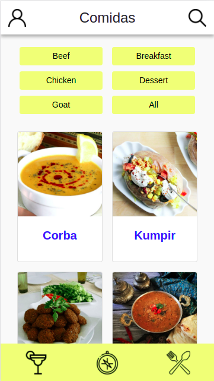
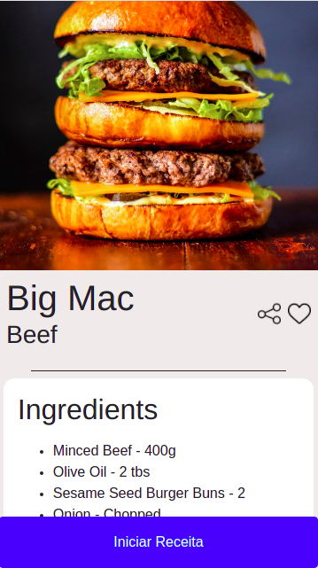

# Recipes App
A simple application that allows you to check many recipes from all over the world. In this project, the main objective was to develop an application that consults two APIs and show in a user-friendly way recipes and its specifications. This application had been built using react, CSS, HTML and react hooks. Enjoy the tour! 
<br>
The main objective of this project was to put into practice all the knowledge acquired at Trybe in the Front-End module, creating a real and functional application.

## Preview
You can check a demonstration of the application running clicking at the link bellow:
[watch a video of demonstration.](https://youtu.be/OX5L9WWe3xc)





## What did I learn?
* How to use contextAPI and react hooks to manage information throughout the application;
* How to develop a project applying agile methods such as Scrum;
* How to work asynchronously;
* How to build a clean and legible code;
* How to create functional React components;

## APIs
[Meals API](https://www.themealdb.com/);
[Drinks API](https://www.thecocktaildb.com/api.php);

## Technologies
* [React](https://reactjs.org/);
* [React Hooks](https://pt-br.reactjs.org/docs/context.html);
* [React-bootstrap](https://react-bootstrap.github.io/);
* [Hooks](https://pt-br.reactjs.org/docs/hooks-intro.html);
## The crew
* [Lucas](https://github.com/LucasH-Paz);
* [Mateus](https://github.com/mateussays);
* [Fernando](https://github.com/fcbresende);
## How to run it
To run this project, install it locally using npm:
1.  Open the terminal and create a local directory:
``` 
mkdir projects
```
2.  Clone the project:
```
cd projects
git clone https://github.com/LucasH-Paz/Recipes-app.git
```
  3.  Install dependencies:
```
cd RecipesApp
npm i
```
  4.  For last, run  **npm start**  to open the app in your browser;

